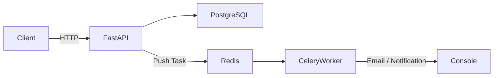
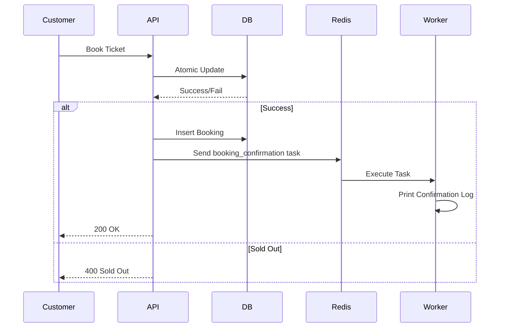
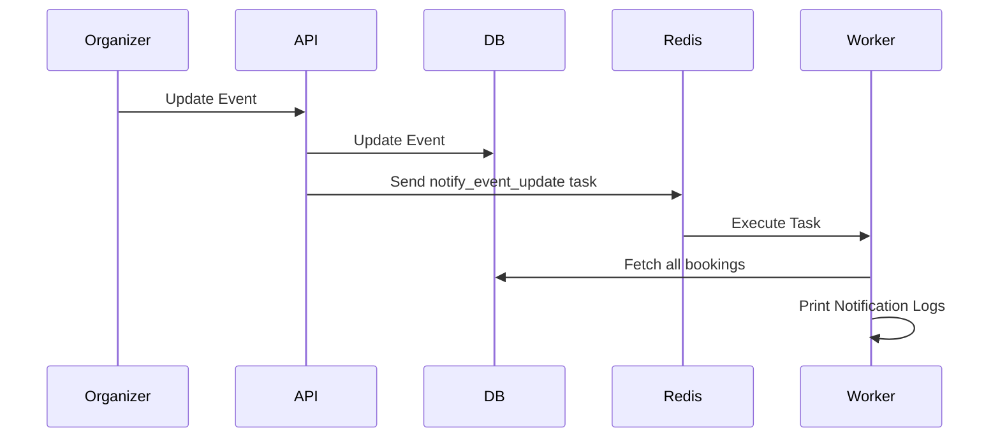
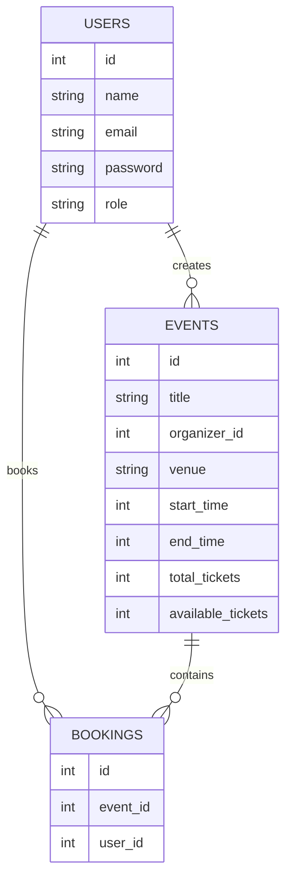

# 🎟 Event Booking System

[]()
[]()
[]()
[]()
[]()
[]()

A **production-grade Event Booking Backend System** built with FastAPI, PostgreSQL, Redis, and Celery.

Supports:

- 👨‍💼 Event Organizers
- 🎫 Customers

Implements:

- Role-based API access
- Atomic ticket booking (race-condition safe)
- Background job processing
- Event update notifications
- Dockerized setup
- Multi-platform image builds

---

# 🏗 Architecture Overview



---

# 🎯 Features

- Create and manage users (Organizer / Customer)
- Organizers can create & update events
- Customers can book tickets
- Prevents overselling using atomic updates
- Async background jobs with Celery
- Event update notifications to booked users
- Fully Dockerized
- Multi-platform build (amd64 + arm64)

---

# 🧠 Concurrency Strategy

To prevent race conditions and overselling, the system uses an atomic conditional update:

```sql
UPDATE events
SET available_tickets = available_tickets - 1
WHERE id = :event_id
AND available_tickets > 0
RETURNING id;
```

### Why this approach?

- No explicit table locking required
- Safe under high concurrency
- Prevents lost updates
- Ensures ACID compliance
- Horizontally scalable

---

# 🔄 Booking Flow



---

# 🔔 Event Update Flow



---

# 🗄 Database Schema



---

# 🚀 Getting Started

## 🐳 Run with Docker

```bash
docker compose up --build
```

API will be available at:

```
http://localhost:8000/docs
```

Stop containers:

```bash
docker compose down
```

---

# 🌍 Multi-Platform Build (Mac, Windows, Ubuntu)

This project supports:

- linux/amd64
- linux/arm64

### Enable Buildx

```bash
docker buildx create --use
```

### Build & Push Multi-Arch Image

```bash
docker buildx build \
  --platform linux/amd64,linux/arm64 \
  -t yourdockerhub/event-booking:latest \
  --push .
```

---

# 🔐 Role-Based Access

| Role        | Permissions                    |
|------------|--------------------------------|
| Organizer  | Create / Update Events         |
| Customer   | Browse Events / Book Tickets   |

Access control is enforced at the API layer.

---

# 🧪 Example API Usage

## 1️⃣ Create Organizer

POST `/users`

```json
{
  "email": "organizer@test.com",
  "password": "123",
  "role": "organizer"
}
```

---

## 2️⃣ Create Customer

POST `/users`

```json
{
  "email": "customer@test.com",
  "password": "123",
  "role": "customer"
}
```

---

## 3️⃣ Create Event

POST `/events/{organizer_id}`

```json
{
  "title": "Music Concert",
  "total_tickets": 50
}
```

---

## 4️⃣ Book Ticket

POST `/book/{user_id}`

```json
{
  "event_id": 1
}
```

Celery Worker Output:

```
📧 Booking confirmation sent to user
```

---

## 5️⃣ Update Event

PUT `/events/{event_id}`

Celery Worker Output:

```
🔔 Notified 23 users about event update
```

---

# ⚙️ Tech Stack

| Layer        | Technology   | Reason |
|-------------|-------------|--------|
| API         | FastAPI     | High-performance async framework |
| Database    | PostgreSQL  | ACID compliance & concurrency control |
| Task Broker | Redis       | Fast in-memory queue |
| Worker      | Celery      | Distributed async processing |
| Container   | Docker      | Portable deployments |
| Build Tool  | Docker Buildx | Multi-arch builds |

---

# 📈 Scalability Design

- Stateless API layer
- Horizontally scalable Celery workers
- Atomic DB updates prevent race conditions
- Redis handles high-throughput task processing
- Ready for Kubernetes deployment

---

# 🛡 Production Hardening (Recommended Improvements)

- JWT Authentication
- Email integration (SES / SendGrid)
- Retry policy in Celery
- Dead-letter queues
- Monitoring (Prometheus + Grafana)
- Structured logging
- Rate limiting
- Idempotency keys for booking
- Seat reservation timeout logic

---

# ☁ Deployment Options

### Option 1: Single VM
- Docker Compose
- Nginx reverse proxy
- SSL via Certbot

### Option 2: Kubernetes
- Separate API & Worker deployments
- Managed PostgreSQL
- Redis as service
- Horizontal Pod Autoscaler

---

# 🧠 Why This Is Production-Ready

- Clean separation of concerns
- Async processing architecture
- Race-condition safe booking logic
- Containerized infrastructure
- Multi-platform support
- Horizontally scalable

---

# 📜 License

MIT License

---

# 👨‍💻 Author

Backend system demonstrating:

- Concurrency control
- Distributed task queues
- Scalable architecture
- Role-based access control
- Docker multi-platform builds
